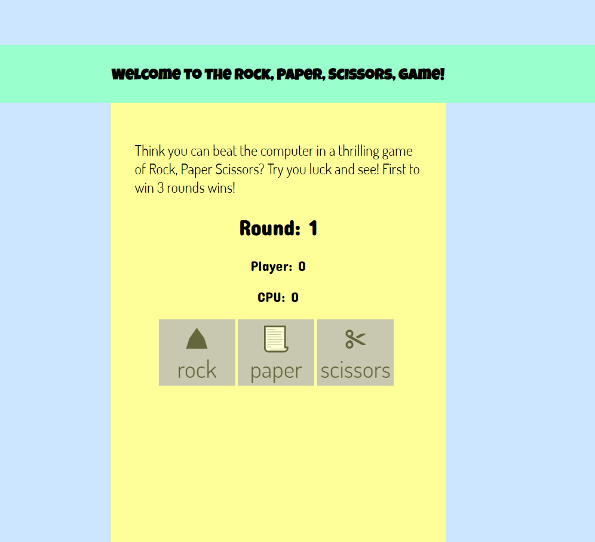
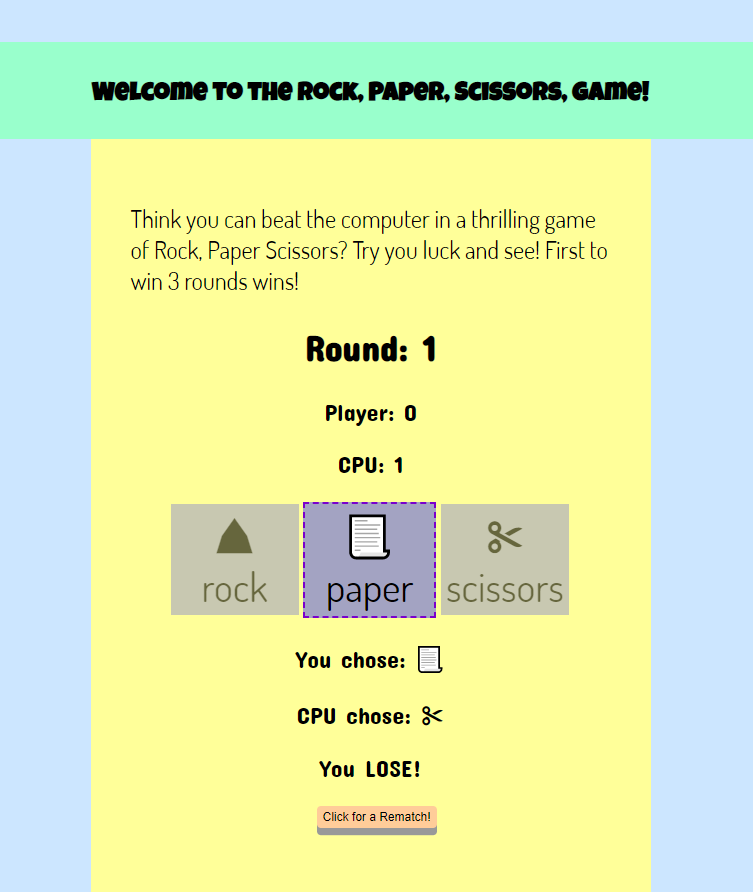
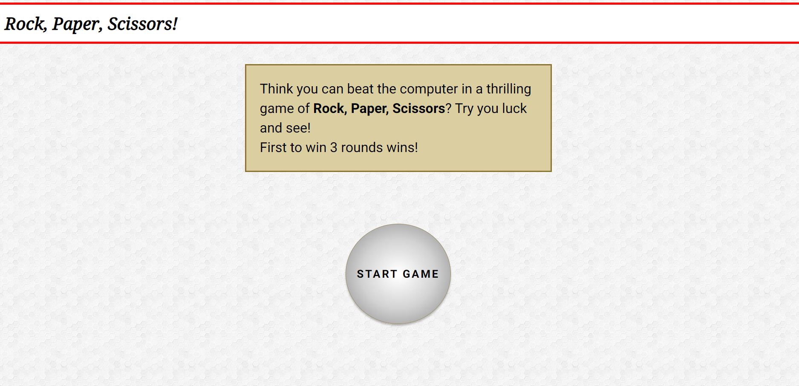
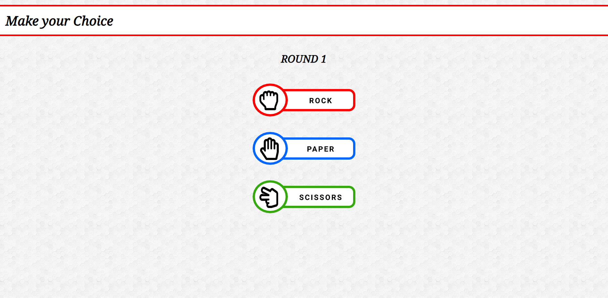
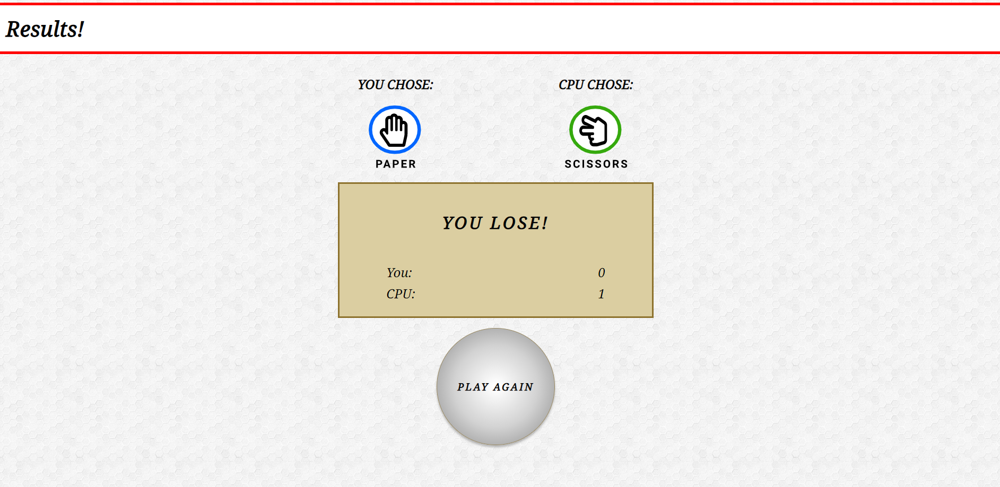

# ROCK, PAPER, SCISSORS!<!-- omit in toc -->

 

## Version 2.0<!-- omit in toc -->

- **Project Updated:** July 21, 2021

 

# CONTENTS
- [CONTENTS](#contents)
  - [Introduction](#introduction)
  - [Screenshots](#screenshots)
  - [Updates Made](#updates-made)
  - [Tools I Used](#tools-i-used)
  - [What I learned](#what-i-learned)
  - [Items for further study](#items-for-further-study)
  - [About me](#about-me)
 

Introduction
---
When I first started my Frontend Journey, I used The Odin Project as my learning platform of choice. One of the earliest JavaScript exercises was to write Rock, Paper, Scissors using CL. 

Fast forward several months later, and I decided to revisit it by adding a graphic interface.

 

Screenshots
---

**Version 1:**

**Version 2 (DESKTOP):**

 

Updates Made
---

The previous version was made with Desktop in mind. I've updated it so that it will work on Mobile as well. 

In addition, I updated the UI to make it look nicer.

 

Tools I Used
---

* HTML
* CSS
* Vanilla JavaScript

 

What I learned
---

Guess this is more of a "What I practiced", as I went wild with flexbox to get the layout to behave! 😋

 

Items for further study
---

I'm still diving into React, and once I'm a bit more versed in it, I would like to refactor everything with React in mind.

Also, make some more changes to the UI.

 

About me
---

Thanks for checking out this project! 😃 You can find my profiles at these sites:
- [Twitter: @IT_Sonji](https://twitter.com/sonji_it)
- [Frontend Mentor - @infinity-Mineeva](https://www.frontendmentor.io/profile/Infinity-Mineeva)